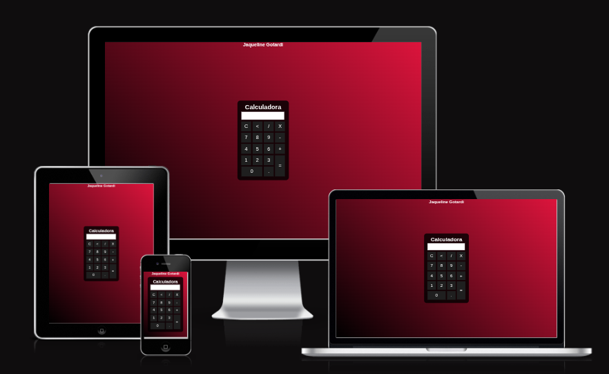

# 🖤 Calculadora Simples - Projeto de Prática

Olá! 👋  
Este é um dos meus **primeiros projetinhos** feitos com minhas próprias mãos, com muito carinho, inspirado em uma aula do YouTube. Não foi 100% original, mas foi totalmente **prático e meu aprendizado**! 💻✨  

## 📌 Sobre o projeto
Uma **calculadora básica** feita em **HTML, CSS e JavaScript**, onde você pode:  
- Somar ➕, subtrair ➖, multiplicar ✖️ e dividir ➗;
- Inserir números e pontos decimais;
- Limpar (`C`) e apagar o último número (`<`);
- Ver o resultado instantaneamente com `=` ✅;

O objetivo desse projeto foi **praticar lógica e manipulação do DOM** em JavaScript, além de brincar com estilo usando CSS.  

## 🎨 Tecnologias usadas
- **HTML** – estrutura da calculadora;
- **CSS** – cores, gradientes e layout centralizado;
- **JavaScript** – lógica de inserção, cálculo, limpeza e backspace;

## ⚡ Como usar
1. Abra o arquivo `index.html` no seu navegador 🌐;
2. Clique nos botões para inserir números e operações;
3. Veja o resultado aparecer na tela instantaneamente;

## 📝 Observações
- Este projeto foi feito para **prática pessoal**, então ele ainda é bem básico;
- Inspiração: uma aula do YouTube, mas todas as linhas de código foram digitadas **por mim**, testadas e ajustadas 😄;
- Ideal para iniciantes que querem **aprender interatividade com JavaScript**;

## 👩‍💻 Próximos passos
- Melhorar a responsividade 📱;
- Adicionar teclado numérico real e suporte a teclado físico ⌨️ ;
- Deixar o design mais moderno com animações ✨;
